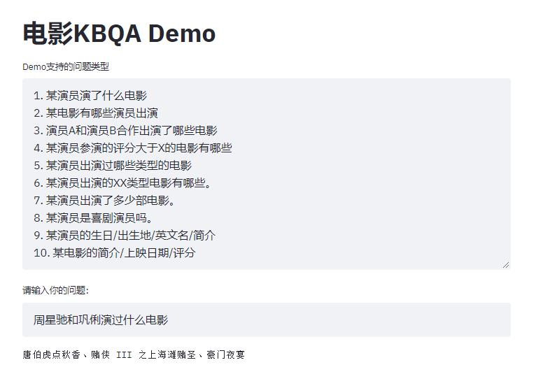

# 上手教程
如果对相关概念不是很了解，建议可以先看看该代码配套的[知乎专栏](https://zhuanlan.zhihu.com/knowledgegraph)系列文章。

# Demo效果



# 环境配置
1. Python版本为3.6
2. 安装依赖`pip install -r requirements.txt`。
3. jena版本为3.5.0，已经上传在该repo中（如果不用Docker运行demo，需要自己修改配置文件中的路径）。
4. d2rq使用的0.8.1

# 运行方式

这里提供两种运行demo的方式：
1. 直接构建docker镜像，部署容器服务。推荐这种方式，已经把各种环境配置好了。只需要安装docker，构建镜像。
2. 直接在本地运行。需要自行修改配置文件（jena/apache-jena-fuseki-3.5.0/run/configuration/fuseki_conf.ttl配置文件中的路径）

## 构建docker镜像

进入项目根目录

```shell script
docker build -t kbqa:V0.1 .
docker run -p 80:80
```
打开浏览器，输入localhost，即能看到demo界面。

## 本地运行

其实就是把Dockerfile里面的命令直接在本地环境运行（记得修改configuration/fuseki_conf.ttl中的文件路径）。

第一步：安装依赖库
```shell script
pip3.6 install -r requirements.txt -i https://pypi.tuna.tsinghua.edu.cn/simple/
```

第二步：将nt格式的三元组数据以tdb进行存储（怎么得到kg_demo_movie.nt文件请参考[实践篇二](https://mp.weixin.qq.com/s/3sYSv4-BPU3wDyZWCzeUMg)）。
```shell script
/kbqa/jena/apache-jena-3.5.0/bin/tdbloader --loc="path_of_tdb" "path_of_kg_demo_movie.nt" # 自行指定tdb的路径，记得和configuration/fuseki_conf.ttl中一致
```

window环境是使用/kbqa/jena/apache-jena-3.5.0/bat/tdbloader.bat

第三步：设置环境变量（windows如何设置请自行查询；也可以不设置streamlit端口，使用默认端口，第五步启动后会提示服务的端口）

```shell script
export LANG=C.UTF-8 LC_ALL=C.UTF-8 STREAMLIT_SERVER_PORT=80 FUSEKI_HOME=/kbqa/jena/apache-jena-fuseki-3.5.0
```

第四步：运行fuseki（进入apache-jena-fuseki-3.5.0子目录，windows运行fuseki-server.bat）

```shell script
./fuseki-server
```

第五步：运行web服务。

```shell script
streamlit run streamlit_app.py --server.enableCORS=true
```

打开浏览器，输入指定的地址即可。


# 问题集锦

1. fuseki-server服务启动后，关闭重启会报错。这是jena的一个bug，把tdb中的文件删了，重新用tdbloader命令生成一次即可。

# 目录结构

## Data文件夹

包含ER图模型文件和创建数据库、表，插入所有数据的sql文件。用户可以直接使用sql文件导入数据到mysql中。

## kg\_demo_movie文件夹
- crawler中的movie_crawler用于从The Movie DB下载数据，用户需要自己去网站注册账号，申请API KEY。在脚本中填入自己的API KEY，填写mysql相关参数即可运行。用户需要额外下载的包:requests和pymysql。tradition2simple用于将繁体字转为简体字（声明一下，我找不到该文件的出处了，我是从网上找到的解决方案，如果有用户知道该作者，麻烦告知，我会备注）。
- KB_query文件夹包含的是完成整个问答demo流程所需要的脚本。
	-  "external_dict"包含的是人名和电影名两个外部词典。csv文件是从mysql-workbench导出的，按照jieba外部词典的格式，我们将csv转为对应的txt。
	-  "word_tagging"，定义Word类的结构（即我们在REfO中使用的对象）；定义"Tagger"类来初始化词典，并实现自然语言到Word对象的方法。
	-  "jena\_sparql_endpoint"，用于完成与Fuseki的交互。
	-  "question2sparql"，将自然语言转为对应的SPARQL查询。
	-  "question_temp"，定义SPARQL模板和匹配规则。
	-  "query\_main"，main函数。在运行"query_main"之前，读者需要启动Fuseki服务。

## ontology.owl
通过protege构建的本体，用户可以直接用protege打开，查看或修改。

## kg\_demo\_movie_mapping.ttl
根据d2rq mapping language编辑的映射文件，将数据库中的数据映射到我们构建的本体上。

## kg\_demo_movie.nt
利用d2rq，根据mapping文件，由Mysql数据库转换得到的RDF数据。

## fuseki_conf.ttl
fuseki server配置文件，指定推理引擎，本体文件路径，规则文件路径，TDB路径等

## rules.ttl
规则文件，用于基于规则的推理。

## streamlit_app.py
web demo文件，基于streamlit库。

# 兴趣群

我创建了微信群，给大家提供一个交流的渠道。由于各种原因，我可能无法及时回答大家的问题；同时，个人的力量是渺小的，我对各位遇到的问题也不一定都了解，因此希望大家通过这个群能解决自己遇到的问题。群主题不局限于KG，也包括NLP的一些话题。公众号也会提供一些相关的资源和学习材料。

公众号：尘世美小茶馆（simmer_teahouse）


